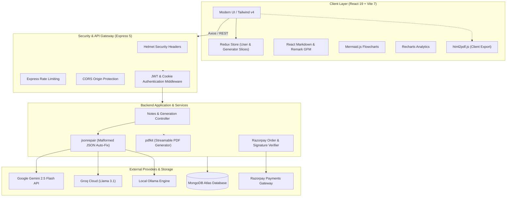

# ExamNotesAI (NoteX) 🎓⚡

> **Next-Generation AI Academic Co-Pilot & Exam Revision Engine**  
> Transforms extensive textbooks, syllabi, and lecture materials into high-retention revision notes, interactive flowcharts, exam analytics, and print-ready PDFs.

[](https://jovac-project-rosy.vercel.app/)
[](https://react.dev/)
[](https://tailwindcss.com/)
[](https://nodejs.org/)
[](https://www.mongodb.com/)
[](https://deepmind.google/technologies/gemini/)

🌐 **Live Application**: [https://jovac-project-rosy.vercel.app/](https://jovac-project-rosy.vercel.app/)

---

## 🏛️ System Architecture



---

## ✨ Key Features

1. **Multi-Engine AI Generation**:
   - High-yield concise summaries, conceptual breakdowns, and key formulas.
   - Practice questions with detailed solutions and difficulty ratings.
   - Dynamic concept mindmaps and flowchart generation via Mermaid.js.
   - Exam weightage and difficulty breakdown via interactive Recharts.

2. **Dual-Engine PDF Export**:
   - **Client-Side Engine (`html2pdf.js`)**: Instant browser-side export preserving styled tables, typography, and page breaks without server load.
   - **Server-Side Engine (`pdfkit`)**: Node.js streaming PDF generator for programmatic and watermarked document generation.

3. **Enterprise Authentication & Security**:
   - Google 1-Tap OAuth via Firebase.
   - Traditional email/password with `bcryptjs` salt hashing.
   - Stateless JWT authentication in `httpOnly` secure cookies.
   - DDoS prevention via `express-rate-limit` and HTTP header hardening via `helmet`.

4. **Billing & Credit Economy**:
   - Integrated Razorpay checkout with HMAC-SHA256 signature verification.
   - Tiered credit balance tracking per user.

5. **Full Administrative Suite**:
   - Real-time metrics overview (revenue, notes count, user growth).
   - User privilege management and manual credit allocation.
   - Content moderation flags and system settings controls.

---

## 🛠️ Complete Tech Stack

| Domain | Technology | Purpose / Implementation |
| :--- | :--- | :--- |
| **Frontend Framework** | **React 19** | Reactive component tree with strict mode and functional hooks. |
| **Build System** | **Vite 7** | Sub-millisecond HMR with `@` path aliasing and rollup code-splitting. |
| **Styling** | **Tailwind CSS v4** | Modern utility-first engine with CSS custom variables and theme transitions. |
| **State Management** | **Redux Toolkit** | Centralized slices for user auth (`userSlice`) and generation jobs (`generatorSlice`). |
| **Visualizations** | **Mermaid.js + Recharts** | Dynamic SVG flowcharts and analytical topic weightage charts. |
| **Client PDF** | **`html2pdf.js`** | Client-side DOM-to-PDF compiler with smart page breaks. |
| **Animations** | **Motion + Lottie** | Framer Motion layout transitions and lightweight vector JSON animations. |
| **Backend Runtime** | **Node.js (ESM)** | Modern ES Module runtime (`import`/`export`). |
| **Server Framework** | **Express 5** | REST routing, error handling pipeline, and controller architecture. |
| **Database** | **MongoDB + Mongoose 9** | Strongly typed document schemas, indexes, and relationship population. |
| **Server PDF** | **`pdfkit`** | High-performance streaming PDF generation on Node.js. |
| **Primary AI Engine** | **Google Gemini 2.5 Flash** | High-speed structured JSON inference for syllabus parsing. |
| **Alternative AI** | **Groq (`llama-3.1-8b`)** | Ultra-low latency fallback LLM. |
| **Local AI** | **Ollama (`llama3.2:3b`)** | Offline / self-hosted open-source model support. |
| **JSON Sanitizer** | **`jsonrepair`** | Heuristic auto-repair of malformed or truncated AI JSON strings. |
| **Payments** | **Razorpay** | Secure order creation and cryptographic SHA256 signature verification. |

---

## 📂 Repository Layout

```text
ExamNotesAI/
├── client/                     # Frontend Application
│   ├── public/                 # Static public assets & brand icons
│   ├── src/
│   │   ├── assets/             # Images and Lottie animations
│   │   ├── components/         # UI components & admin dashboard tabs
│   │   │   ├── admin/          # Dedicated administration sub-components
│   │   │   └── lightswind/     # Specialized UI controls (theme toggle)
│   │   ├── config/             # Centralized application constants & routes
│   │   ├── lib/                # Shared utilities (twMerge, clsx `cn`)
│   │   ├── pages/              # Primary route views (Dashboard, Notes, Auth, etc.)
│   │   ├── redux/              # Global state store and slices
│   │   ├── services/           # Axios HTTP client API calls
│   │   └── utils/              # PDF export & Firebase OAuth configurations
│   ├── vite.config.js          # Vite config with `@` alias
│   └── package.json            # Client dependencies
│
├── server/                     # Backend Application
│   ├── controllers/            # Controller business logic
│   ├── middleware/             # Auth (`isAuth`) & Admin (`isAdmin`) guards
│   ├── models/                 # Mongoose schemas (User, Notes, Payment, Admin)
│   ├── routes/                 # Express API routes
│   │   ├── notes.route.js      # Primary notes endpoints
│   │   ├── genrate.route.js    # Backward-compatibility alias
│   │   ├── auth.route.js       # Authentication endpoints
│   │   ├── user.route.js       # User profile and preferences
│   │   ├── payment.route.js    # Razorpay checkout & verification
│   │   └── admin.route.js      # Administrative oversight & analytics
│   ├── services/               # Multi-LLM provider integrations (Gemini, Groq, Ollama)
│   ├── utils/                  # DB connection, token signing, AI parsing
│   ├── index.js                # Express entrypoint & security middleware
│   └── package.json            # Backend dependencies
│
├── AGENTS.md                   # AI Agent operating rules & standards
├── SKILLS.md                   # Technical skills, workflows & API protocols
├── README.md                   # Project documentation
└── vercel.json                 # SPA deployment rewrite configuration
```

---

## 🚀 Getting Started

### Prerequisites
- **Node.js**: v18.0.0 or higher
- **npm**: v9.0.0 or higher
- **MongoDB**: Local URI or MongoDB Atlas connection string

### 1. Clone the Repository
```bash
git clone https://github.com/your-username/ExamNotesAI.git
cd ExamNotesAI
```

### 2. Configure Environment Variables

**Backend (`server/.env`):**
```env
PORT=8000
MONGO_URI=mongodb+srv://<username>:<password>@cluster.mongodb.net/examnotes
JWT_SECRET=your_super_secret_jwt_key
CLIENT_URL=http://localhost:5173

# AI Providers
GEMINI_API_KEY=your_gemini_api_key
GROQ_API_KEY=your_groq_api_key

# Payment Gateway
RAZORPAY_KEY_ID=your_razorpay_key_id
RAZORPAY_KEY_SECRET=your_razorpay_secret
```

**Frontend (`client/.env`):**
```env
VITE_SERVER_URL=http://localhost:8000
VITE_FIREBASE_API_KEY=your_firebase_key
VITE_FIREBASE_AUTH_DOMAIN=your_project.firebaseapp.com
VITE_FIREBASE_PROJECT_ID=your_project_id
```

### 3. Install Dependencies & Launch

```bash
# Terminal 1: Backend Server
cd server
npm install
npm run dev

# Terminal 2: Frontend Client
cd client
npm install
npm run dev
```

Visit **`http://localhost:5173`** to access the application.

---

## 🔒 Security & Developer Conventions

Please refer to:
- **[AGENTS.md](file:///Users/madhavpratapsingh/Desktop/1.ExamNotesAI/AGENTS.md)** for AI assistant operating guidelines, coding conventions, and architectural boundaries.
- **[SKILLS.md](file:///Users/madhavpratapsingh/Desktop/1.ExamNotesAI/SKILLS.md)** for detailed feature workflows, prompt schemas, and payment verification specifications.
